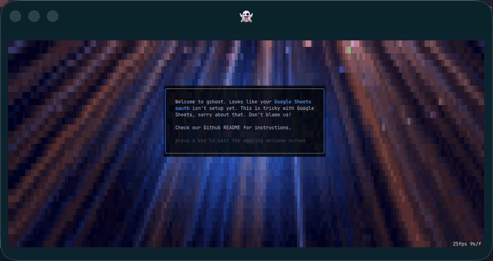

[](https://github.com/gurgeous/gshoot/actions/workflows/ci.yml)


# gshoot

`gshoot` is a CLI to magically import and export CSVs from Google Sheets. It has a few carefully chosen features along those lines.

For example, if I'm analyzing my local zoo I might run `gshoot up Zoo zoo.csv --numeric --layout --filter` to create a nice-looking Google Sheet. If I add more rows to `zoo.csv`, I can run `gshoot up Zoo zoo.csv --refill` to add the new data without messing up the Google Sheet. For some projects I do this dozens of times a day.

That's it, that's the whole thing. Be sure to check out our [authentication](#authentication) docs if you haven't been through this before with Google Sheets.

### Demo

Normally I'd put a CLI demo in here to show what `gshoot` can do, but the actual output isn't that exciting. Instead, here's a screenshot of the incredible welcome screen that shows up the first time you run the thing. Yes, it's animated and alpha blended. It's possible I took this too far



It looks pretty great if you pipe the download into [tennis](https://github.com/gurgeous/tennis)


### Installation

On macOS use brew:

```
$ brew install gurgeous/tap/gshoot
```

For Linux, see the [latest release on GitHub](https://github.com/gurgeous/gshoot/releases/latest). You'll find macOS builds in there too, but they are difficult to run since they are unsigned. Windows is not yet supported.

### Important Features

- download a CSV from a Google Sheets file (and maybe a specific sheet)
- upload a CSV into a Google Sheets file (and maybe replace/merge into an existing sheet)
- `up --replace` mode to overwrite an existing sheet
- `up --refill` mode to merge data into an existing sheet, leaving other columns untouched
- `up` has lots of little helpers to make life easier like `--filter`, `--layout`, `--numeric` and `--open`

### Options

```
$ gshoot --help

Magically upload/download CSVs from Google Sheets.

Commands:
  auth login     Login via OAuth. (start here!)
  auth logout    Logout of OAuth.
  auth status    Show auth status.
  down           Download a Google Sheet as CSV.
  up             Upload a CSV to Google Sheets.
  list           List your Google Sheets.
  peek           List sheets in a spreadsheet.
  wipe           Wipe/delete all data from a spreadsheet.
```

### Authentication

Getting `gshoot` to talk to Google Sheets is challenging, to put it mildly. Don't blame me, I do not work for Google and I did not design this system. `gshoot` talks to Google Sheets as you, using a _Google Cloud project_ that _you create_. Again, I would like to apologize in advance. This is just incredibly complicated and error-prone.

I recommend these three well-written tutorials:

- [gogcli](https://github.com/openclaw/gogcli/blob/main/docs/quickstart.md#2-get-an-oauth-client)
- [gws](https://github.com/googleworkspace/cli/blob/main/README.md#manual-oauth-setup-google-cloud-console)
- [UCSB CS156](https://ucsb-cs156.github.io/topics/oauth/google_oauth_consent_screen.html)

The goal here is something like:

| Step                                                                                                                                                                                                                                                                                                                                                                                                                                                                                                | Helpful Screenshot_Had_To_Use_Long_Name_Here                                                                                                                                                                                                                                 |
| --------------------------------------------------------------------------------------------------------------------------------------------------------------------------------------------------------------------------------------------------------------------------------------------------------------------------------------------------------------------------------------------------------------------------------------------------------------------------------------------------- | ---------------------------------------------------------------------------------------------------------------------------------------------------------------------------------------------------------------------------------------------------------------------------- |
| 1. Create a new **Google Cloud Project** to contain your OAuth setup. SELECT YOUR PROJECT!! You might have to wait a second before you can do that, Google is slow.                                                                                                                                                                                                                                                                                                                                 |                                                                                                                                            |
| 2. In your new project, enable these two Google APIs: **Google Drive** and **Google Sheets**. If your project doesn't enable these two APIs, nothing will work. Ever.                                                                                                                                                                                                                                                                                                                               |                                                                                                                                            |
| 3. Configure the **OAuth Consent Screen**. Pick whatever name/email you want, you are the only human alive who will see this screen. If your Google account is a "Google Workspace" account with a custom domain, set this up as **Internal Audience**. Otherwise use **External Audience**. If you use **External Audience**, add your email as the sole test user. This is required. No test user, no access for you. Is it strange Google doesn't automatically do this for you? I think so too! | <br><br> |
| 4. Create a **Desktop OAuth Client**. Yes, I know that `gshoot` has nothing to do with desktop and this is very confusing. This is just what Google calls this kind of authentication.                                                                                                                                                                                                                                                                                                              |                                                                                                                                            |
| 5. Download the **OAuth Client Secrets JSON** file from your "Desktop App". Google gives it a really simple name like `client_secret_XXXXXXXXXXXX.com.json`.                                                                                                                                                                                                                                                                                                                 |                                                                                                                                            |

and finally we get to the part where gshoot can actually do something:

```sh
$ gshoot auth login --client-secret client_secret_XXXXXXXXXXXX.com.json
```

### Changelog

#### 0.1.0 (unreleased)

- initial release
